*REMOVE*
remove DISABLE_COLLECTSTATIC 1 from Heroku

# TheWalkingShoes
TheWalkingShoes is a place for everyone. Its a place where you can trade shoes that dosn't fit, you got bored of them or wanting to contribute to the enviorment and buy used rather then new.

See images of different mobile views on. Static/image-readme

The live link for "thewalkingshoes" can be found [HERE](XX)

## Table of Contents
+ [UX](#ux "UX")
  + [Site Purpose](#site-purpose "Site Purpose")
  + [Site Goal](#site-goal "Site Goal")
  + [Audience](#audience "Audience")
  + [Communication](#communication "Communication")
  + [Current User Goals](#current-user-goals "Current User Goals")
+ [User Stories](#user-stories "User Stories")

+ [Design](#design "Design")
  + [Colour Scheme](#colour-scheme "Colour Scheme")
  + [Typography](#typography "Typography")
  + [Imagery](#imagery "Imagery")
+ [Features](#features "Features")
  + [Existing Features](#existing-features "Existing Features")
  + [C.R.U.D](#crud "C.R.U.D")
+ [Testing](#testing "Testing")
  + [Validator Testing](#validator-testing "Validator Testing")
  + [Unfixed Bugs](#unfixed-bugs "Unfixed Bugs")
+ [Technologies Used](#technologies-used "Technologies Used")
  + [Main Languages Used](#main-languages-used "Main Languages Used")
  + [Frameworks, Libraries & Programs Used](#frameworks-libraries-programs-used "Frameworks, Libraries & Programs Used")
+ [Deployment](#deployment "Deployment")
+ [Credits](#credits "Credits")
  + [Content](#content "Content")
  + [Media](#media "Media")

## UX

### Site Purpose:
TheWalkingShoes is a place for everyone. Its a place where you can trade shoes that dosn't fit, you got bored of them or wanting to contribute to the enviorment and buy used rather then new. The idea come from the movie "the traveling pants" Why not share the shoes that you don't use anymore to others. Its a different form of recycling compare to buying from secondhand.

### Site Goal:
The sites goal is to give shoe fanatics a place where they can meet eachother and share their shoes.

### Audience:
all ages all genders. the more that uses the webpage the better its going to work.

### Communication:
The idea behind the comunication is that everything should be displayed on the website but if you still wanna remain semi annonumous you can write your discord username in the discription and that way that comunication between the parties can begin.

### Current User Goals:
Is to help with what should to get and what to think about though the blog.
and let the comunity develop into something that can make trading shoes a monthly thing.

### Future Goals:
- To create a profile page for each trader that can be used to have a stock inventory that goes around.
- To view all the available shoes posted by a trader on their profile page
- To allow users to follow traders directly.
- Let the community start posting on the blog aswell.

### user-stories:


## Design

### Wireframes: Created on figma

##### Home Page: 

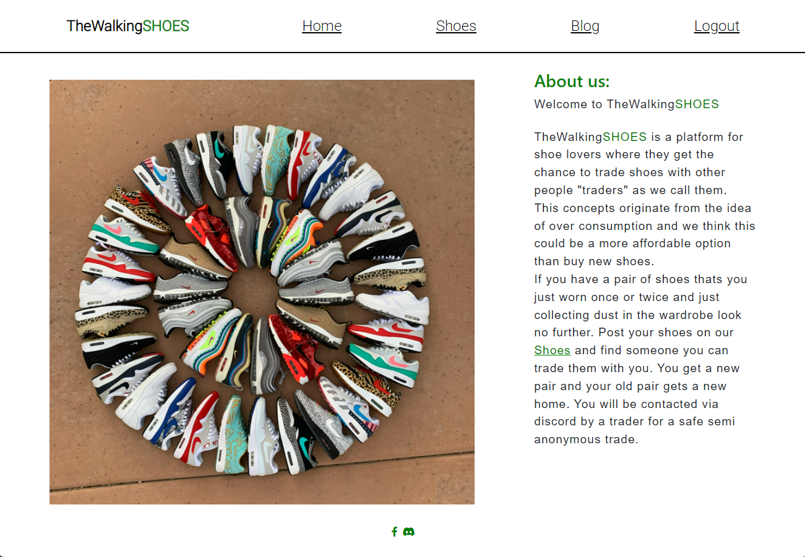

##### Blog Page:


##### Blod Post Details:


##### Site Navigation:


### Colour Scheme:


### Typography:
All fonts were obtained from the Google Fonts library. I chose the following fonts for the page:
1. Roboto: Nav, h1
2. Nunito: used for the rest
3. sans-serif: as a backup

### Imagery:
- All images were taken from unsplash, https://unsplash.com/
- Wireframe was made in figma. https://www.figma.com/

#### Home Page:


#### Navigation Bar:

##### Desktop:


##### Mobile:

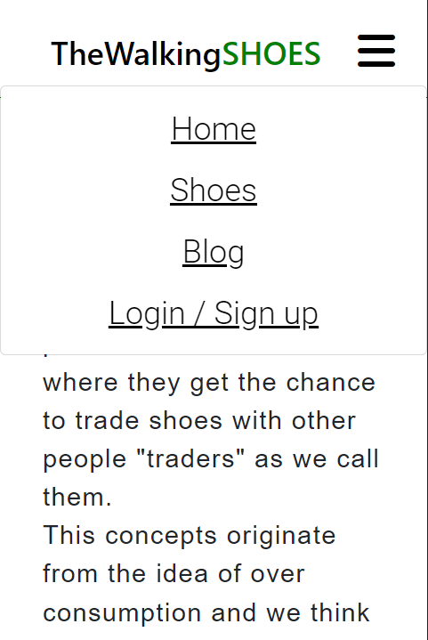


#### Shoes Page:

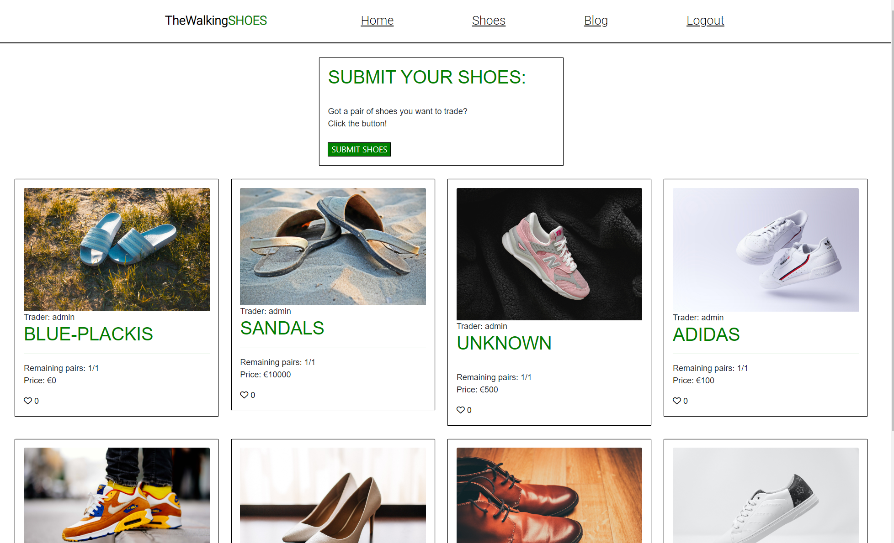

#### Shoes Details Page:

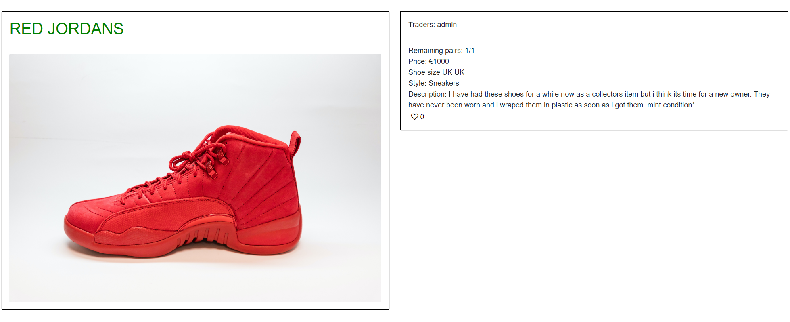

#### Blog Page:

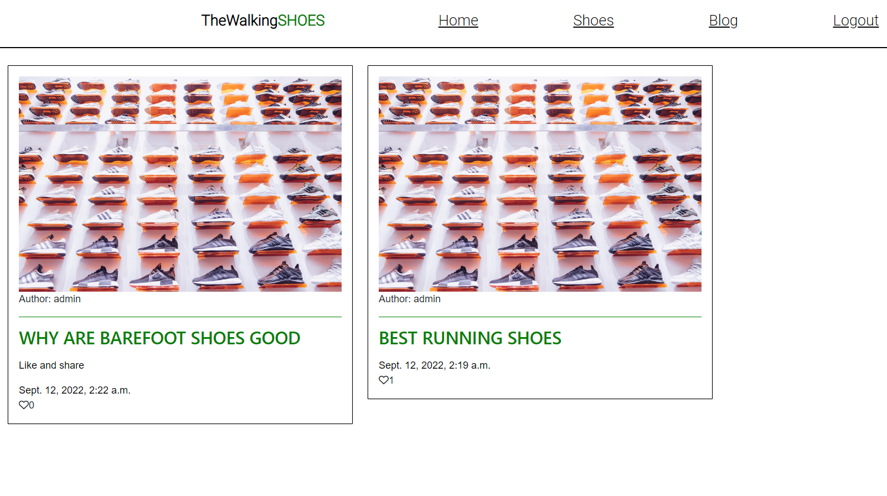

#### Blog Post Details:

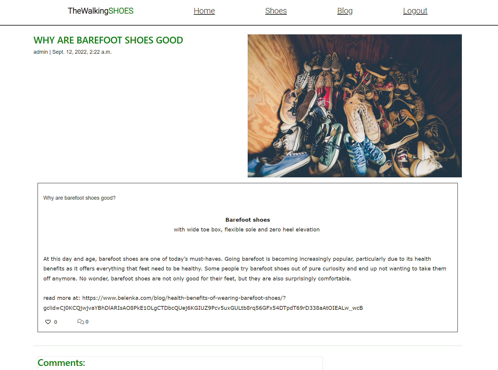
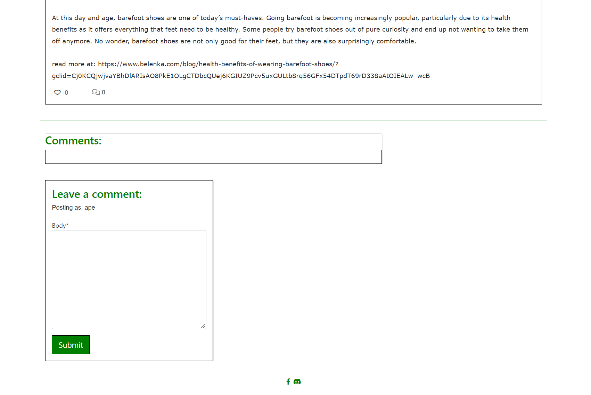

#### Log in, Log out & Sign up:

##### Login:

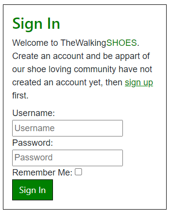

##### Logout:

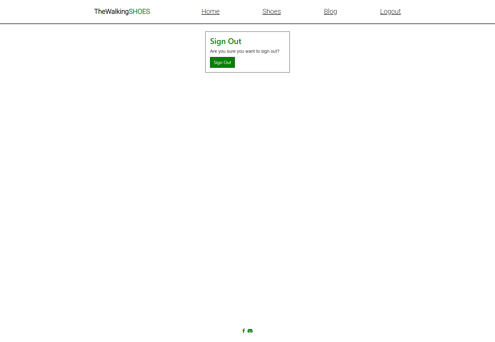

##### Sign-up:


#### Social Links:

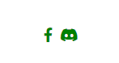

### C.R.U.D:

#### Create (button):
- The button to invite you to submit shoes will be found on the **"Shoes"** page.
- It is only visible to users who are signed in.
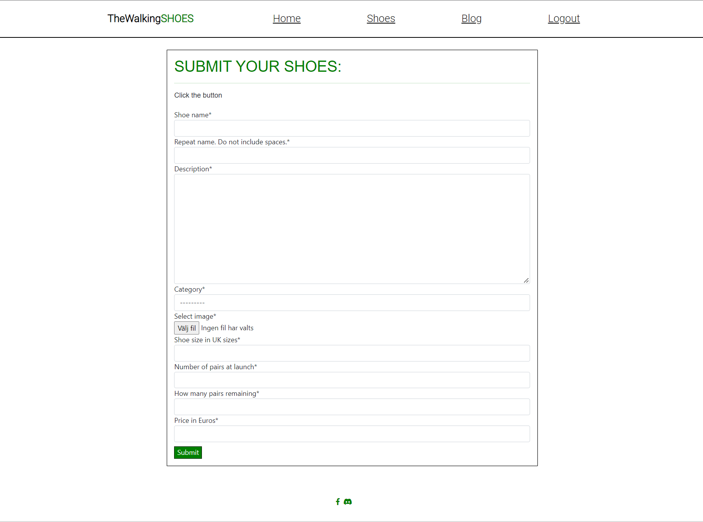

#### Create (form):
- This page may only be accessed from the button on the **"Prints"** page.
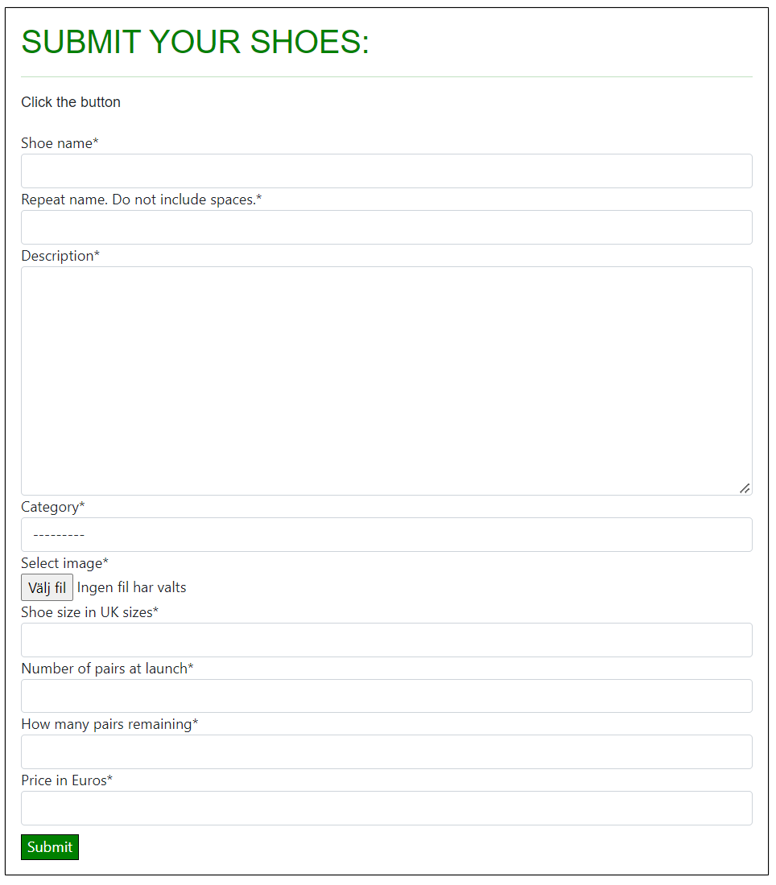

#### Read:


#### Update & Delete:
- The update & delete feature is only available to the user who who directly submitted the shoes.
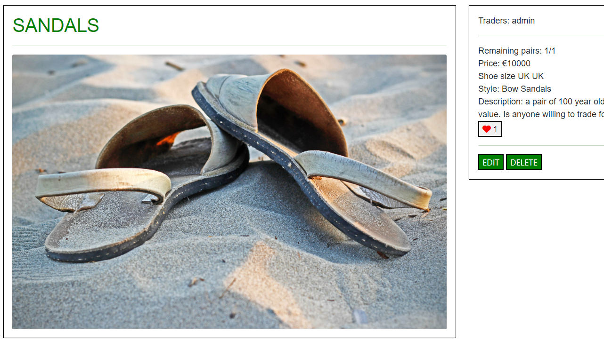

### Features Left to Implement
- Online shop
- trader profiles
- direct link to discord for each trader
- Password reset
- Social media sign-in

## Testing
1. Sometimes in phone/tablet mode is it possible to swipe the screen to the side in mobile view. this got fixed by reducing the size of the logo.

2. Issue with heroku deployment. after trial and error with a class mate Dave horrocks did just fix the issue by.
downgrading heroku stack from 22 to 20 then we could use runtime and set a python version that was stable and worked.

3. I got this error when trying to deploy to heroku:
    "TypeError: a bytes-like object is required, not 'str'"
solution: i relised that i put the env.py file inside the "thewalkingshoes" folder

### Validator Testing
- html files pass through the [W3C validator](https://validator.w3.org/) with no html issues found
- Errors listed only reference  & {{}} tags, lang and meta errors that should't be mentioned. like:
<html lang="en">
<meta charset="UTF-8">
    <meta http-equiv="X-UA-Compatible" content="IE=edge">
    <meta name="viewport" content="width=device-width, initial-scale=1.0">

- CSS files pass through the [Jigsaw validator](https://jigsaw.w3.org/css-validator/) with no issues found.


- page has an excellent Accessibility rating in Lighthouse

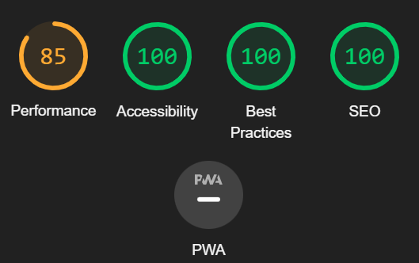

- Python files passed through [PEP8 Online](http://pep8online.com/) with only commenting issues found and 1 line that was to long.


- Tested the site opens with Chrome & firefox without issues.
- All social links open to external pages as intended.

### Unfixed Bugs
The submit shoes pop up dosn't always apear

## Technologies Used
### Main Languages Used
- HTML5
- CSS3
- Javascript
- Python
- Django
- SQL - Postgres

### Frameworks, Libraries & Programs Used
- Font Awesome - to add icons to the social links in the footer element.
- GitPod - to create my html files & styling sheet before pushing the project to Github.
- GitHub - to store my repository for submission.
- figma - were used to create wireframe.
- Django
- Bootstrap


### Installed Packages:
- 'django<4' gunicorn
- dj_database_url psycopg2
- dj3-cloudinary-storage
- django-summernote [(link)](https://summernote.org/)
- django-allauth [(link)](https://django-allauth.readthedocs.io/en/latest/)
- django-crispy-forms[(link)](https://django-crispy-forms.readthedocs.io/en/latest/index.html)

## Deployment
The site was deployed to Heroku. The steps to deploy are as follows:
- Install Django & Gunicorn:
```pip3 install 'django<4' gunicorn```
- Install Django database & psycopg:
```pip3 install dj_database_url psycopg2```
- Install Cloudinary:
```pip3 install dj3-cloudinary-storage```
- Creating the requirements.txt file with the following command:
```pip3 freeze --local > requirements.txt```
- a django project was created using:
```django-admin startproject printstatements .```
- the blog app was then created with:
```python3 manage.py startapp blog```
- which was then added to the settings.py file within our project directory.
- the changes were then migrated using:
```python3 manage.py migrate```
- navigated to [Heroku](www.heroku.com) & created a new app called print-statements.
- added the Heroku Postgres database to the Resources tab.
- navigated to the Settings Tab, to add the following key/value pairs to the configvars:
1. key: SECRET_KEY | value: randomkey
2. key: PORT | value: 8000
3. key: CLOUDINARY_URL | value: API environment variable
4. key: DATABASE_URL | value: value supplied by Heroku
- added the DATABASE_URL, SECRET_KEY & CLOUDINARY_URL to the env.py file
- added the DATABASE_URL, SECRET_KEY & CLOUDINARY_URL to the settings.py file
- add an import os statement for the env.py file.
- added Heroku to the ALLOWED_HOSTS in settings.py
- created the Procfile
- pushed the project to Github
- connected my github account to Heroku through the Deploy tab
- connected my github project repository, and then clicked on the "Deploy" button

## Credits

### Content
- [Dave horrocks](student)(helped me with deployment to heroku)
- [w3schools]general help 
- [stackoverflow] general help
- [darkpuppy](friend) gave clues and feedback

### Media
- all photos were taken from unsplash.com a free to use website